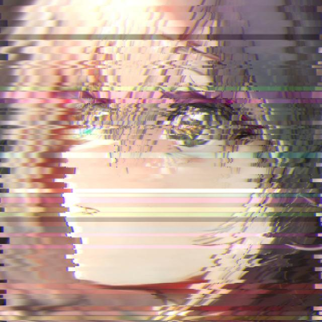

# 🌈 故障艺术头像生成器 (Glitch Avatar Generator)

> 🎨 将普通头像转换为赛博朋克风格的故障艺术！

<div align="center">
  
  
</div>

## 🎯 特性

- 🖼️ 支持任意图片格式（JPG、PNG 等）
- 🎨 随机色彩通道偏移
- 🌈 智能条带扰动效果
- 🔮 自然平滑的过渡效果
- ⚡ 一键生成故障风格

## 🚀 快速开始

### 环境要求

- Python 3.6+
- Pillow
- NumPy

### 安装依赖

```powershell
pip install pillow numpy
```

### 使用方法

1. 克隆项目：

```powershell
git clone https://github.com/yourusername/glitch-avatar.git
cd glitch-avatar
```

2. 将你的头像文件重命名为 `avatar.jpg` 放入项目目录

3. 运行程序：

```powershell
python glitch_avatar.py
```

4. 查看生成的 `avatar_glitch.jpg` 文件

## ⚙️ 自定义参数

你可以通过修改以下参数来自定义故障效果：

```python
glitch_image(
    "avatar.jpg",          # 输入图片
    "avatar_glitch.jpg",   # 输出图片
    max_offset=20,         # 最大错位像素
    band_height=10,        # 条带高度
    color_glitch_prob=0.3  # 色彩扰动概率
)
```

## 🎨 效果说明

- **条带错位**：创建随机水平条带位移
- **色彩扰动**：RGB 通道随机偏移
- **智能模糊**：条带边缘自然过渡
- **亮度调整**：随机区域亮度变化

## 📝 待办事项

- [ ] 添加 GUI 界面
- [ ] 支持更多故障特效
- [ ] 添加预设风格模板
- [ ] 支持视频故障效果

## 📜 开源协议

MIT License © 2025

---

<div align="center">
  <b>玩得开心！欢迎提交你的故障艺术作品！</b>
</div>
