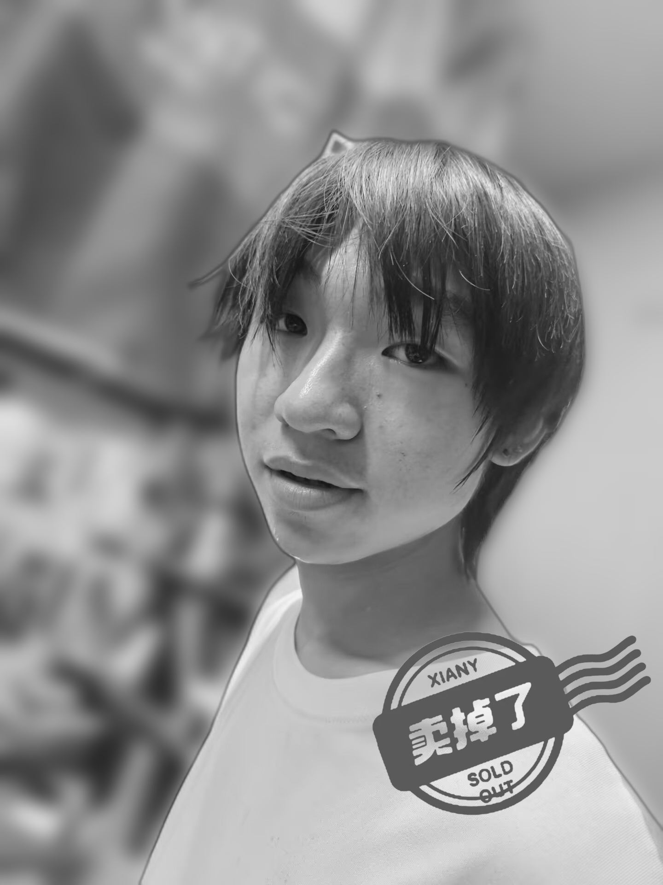

# Sold Out Image Effect Generator

一个简单的 Python 脚本，用于生成类似咸鱼（闲鱼）商品已售出效果的图片处理工具。

## 功能特点

- 智能识别图片主体
- 背景虚化处理
- 自动灰度化效果
- 添加"已售出"水印
- 保持主体清晰度

## 运行环境要求

- Python 3.6+
- Pillow (PIL)
- rembg

## 安装依赖

```bash
pip install Pillow
pip install rembg
```

## 使用方法

1. 准备图片文件：

   - 将要处理的商品图片命名为 `item.jpg` 放在项目目录下
   - 确保 `sold-out.webp` 水印文件存在

2. 运行脚本：

   ```bash
   python sold.py
   ```

3. 输出：
   - 处理后的图片将保存为 `sold-out.png`

## 效果展示

处理前：


处理后：



## 实现原理

1. 使用 rembg 库进行主体识别和提取
2. 对原图进行高斯模糊处理作为背景
3. 将清晰的主体图像叠加到模糊背景上
4. 将整体图像转换为灰度效果
5. 在右下角添加"已售出"水印

## 许可证

MIT License

## 作者

[Orange]

## 借鉴

- [Pillow (PIL)](https://python-pillow.org/)
- [rembg](https://github.com/danielgatis/rembg)
